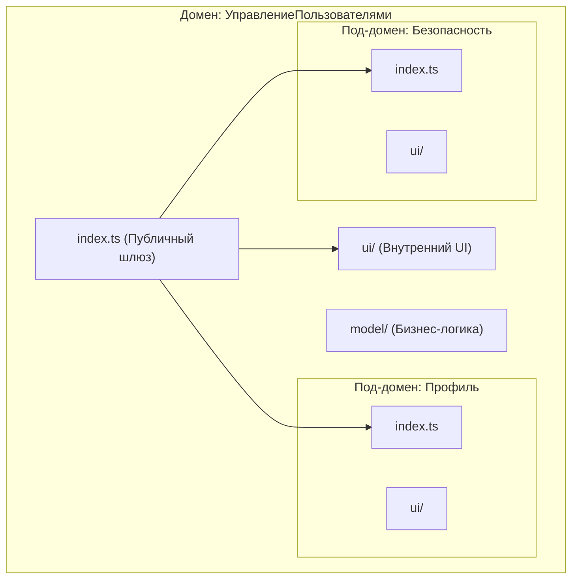

# Архитектура FEOD (Fractal Entity Oriented Design)

## 1. Введение: От Хаоса к Структуре

FEOD — это архитектурный паттерн, разработанный для управления сложностью во фронтенд-приложениях. Он балансирует между строгими правилами и гибкостью, разделяя понятия **Структуры** (где лежат файлы) и **Архитектуры** (как они взаимодействуют).

- **Цель**: Создание предсказуемой, масштабируемой и поддерживаемой системы.
- **Атомарная единица**: **Сущность** (файл или директория с четкой ролью).
- **Главный принцип**: Логика — в **Модулях**, оркестрация — в **App**, композиция — в **Pages**.

---

## 2. Текущая структура проекта (As-Is)

Ниже представлена реальная структура папок проекта, полученная путем рекурсивного обхода. Это отправная точка для перехода на FEOD.

```text
elbruso/
├── apps/
│   ├── api/ (NestJS backend)
│   │   └── src/
│   │       ├── auth-users/ (model, service, controller)
│   │       ├── workspace-groups/
│   │       └── workspaces/
│   └── web/ (Next.js frontend - текущий FSD)
│       └── src/
│           ├── app/ (Next.js App Router: (auth), (profile))
│           ├── entities/ (cell, table)
│           ├── features/ (cell-edit, formula-insert, table-create/edit)
│           ├── shared/ (api, lib, services, stores, ui)
│           ├── views/ (HomePage)
│           └── widgets/ (Header, Footer, WorkspaceTree, DynamicTable)
│
├── packages/ (Разделяемые пакеты)
│   ├── db/ (Миграции и работа с БД: Kysely)
│   ├── debug/ (Инструменты отладки: DebugConsole, Overlay)
│   ├── path-copier/ (SWC плагин для разработки)
│   ├── shared/ (Общие React-компоненты, API-клиент, AuthContext)
│   ├── types/ (Общие TS-типы)
│   └── ui/ (Скомпилированные UI-компоненты)
```

---

## 3. Глобальный Контекст: Сравнение


| Концепция            | Atomic Design        | Feature-Sliced Design | FEOD                                    |
| :------------------- | :------------------- | :-------------------- | :-------------------------------------- |
| **Фокус**            | Иерархия UI          | Изоляция фич          | **Фрактальное масштабирование доменов** |
| **Масштабируемость** | Ограничена (плоская) | Высокая (слоистая)    | **Экспоненциальная (фрактальная)**      |
| **Сложность**        | Просто               | Формально/Тяжело      | **Сбалансировано/Интуитивно**           |

---

## 4. «Большая Картина»: Единая Структура Проекта

Для наглядности приведена единая схема, объединяющая все слои и демонстрирующая глубину вложенности (Mega-Schema).

```text
src/
├── app/ (Слой оркестрации и загрузки - "Мозг")
│   ├── index.ts (Точка входа приложения)
│   ├── boot/ (Инициализация: DI, плагины, конфигурация)
│   ├── router/ (Настройка путей, гварды, переходы)
│   ├── layouts/ (Мастер-шаблоны приложения: Default, Auth)
│   ├── externals/ (Инициализация сторонних сервисов через IoC)
│   └── ui/ (Глобальные элементы: Header, Footer, Sidebar)
│
├── pages/ (Слой композиции страниц - "Сборка")
│   ├── index.tsx (Главная страница /)
│   ├── auth/ (Группа страниц авторизации)
│   │   ├── login.tsx (/auth/login)
│   │   └── _components/ (Приватные модули: логика только для авторизации)
│   └── indicators/
│       ├── [id].tsx (Динамический роутинг)
│       └── layout.tsx (Вложенный лейаут раздела)
│
├── modules/ (Бизнес-логика - "Сердце" / Фрактальные домены)
│   └── Inventory/ (Верхнеуровневый домен)
│       ├── index.ts (Gateway: Публичный API домена)
│       ├── ui/ (Внутренние компоненты домена)
│       ├── model/ (Бизнес-логика, сторы, правила)
│       ├── api/ (Специфические запросы домена)
│       └── modules/ (Вложенные фракталы - Уровень 1)
│           └── Analytics/ (Под-домен аналитики склада)
│               ├── index.ts (Публичный API аналитики)
│               ├── ui/ (Графики, отчеты)
│               └── modules/ (Вложенные фракталы - Уровень 2)
│                   └── ChartGenerator/ (Узкоспециализированный модуль)
│                       ├── index.ts (API генератора)
│                       ├── logic/
│                       └── parts/
│
├── common/ (Общий инструментарий - "Shared" / БЕЗ index.ts)
│   ├── ui/ (Агностичный UI-Kit: Button, Modal, Tooltip)
│   ├── composables/ (Hooks: useLocalStorage, useWindowSize)
│   ├── utils/ (Чистые функции: formatDate, validateEmail)
│   ├── types/ (Базовые DTO и типы)
│   └── meta/ (Общие интерфейсы проекта)
│
└── global/ (Глобальное окружение - "Воздух" / Не импортируется)
    ├── shims/ (Типизация ассетов: svg, images, css)
    └── env/ (Глобальные переменные и константы окружения)
```

---

## 5. Правила Взаимодействия (Import Protocol)


1.  **App**: Импортирует всех. Никто не может импортировать из App.
2.  **Pages**: Импортирует Modules, Common и App (для типов роутинга). Никогда не импортируется модулями.
3.  **Modules**: Импортируют друг друга **только через Публичный API (`index.ts`)**. Могут использовать Common.
4.  **Common**: Не содержит бизнес-логики. Может импортироваться кем угодно. **Запрещены barrel-файлы (index.ts)** для чистоты сборки.
5.  **Global**: Не импортируется явно. Доступен "из воздуха" (через глобальные типы).

---

## 6. Фрактальная Анатомия Модуля

Модули рекурсивны. Глубина вложенности не ограничена, но доступ к внутренностям всегда закрыт "шлюзом" `index.ts`.




---

## 7. Ключевые паттерны и IoC

В FEOD уровень **App** отвечает за внедрение зависимостей (Dependency Injection) и конфигурацию, чтобы модули оставались "глупыми" в плане окружения.


- **Правильно**: App передает API_KEY в модуль при инициализации.
- **Неправильно**: Модуль сам лезет в `process.env` или импортирует конфиг из App.

---

## 8. FEOD в Монорепозитории (pnpm/Turborepo)

При переходе к монорепозиторию (Workspaces) слои FEOD распределяются между приложениями и общими пакетами для максимального переиспользования кода без нарушения изоляции.

### 7.1 Мега-схема Воркспейса

Единая картина того, как FEOD живет в нескольких пакетах.

```text
/ (Корень монорепозитория)
├── apps/ (Проекты / Applications)
│   ├── web/ (Основное SPA)
│   │   └── src/
│   │       ├── app/ (Оркестрация конкретно этого приложения)
│   │       └── pages/ (Страницы конкретного клиента)
│   └── admin/ (Админка)
│       └── src/
│           ├── app/
│           └── pages/
│
├── packages/ (Общие пакеты / Infrastructure & Shared Logic)
│   ├── shared/ (Пакет с общей бизнес-логикой и инструментарием)
│   │   └── src/
│   │       ├── modules/ (Фрактальные домены — как в основной архитектуре)
│   │       │   ├── Inventory/
│   │       │   ├── UserManagement/
│   │       │   └── Analytics/
│   │       └── common/ (Общий инструментарий: типы, хуки, утилиты)
│   │
│   └── ui-kit/ (Выделенный пакет для дизайн-системы / UI-Kit)
│       └── components/ (Агностичные атомы и молекулы)
│
├── pnpm-workspace.yaml
└── package.json
```

### 7.2 Распределение слоев

| Слой        | Локация                       | Описание                                                            |
| :---------- | :---------------------------- | :------------------------------------------------------------------ |
| **App**     | `apps/*/src/app`              | Всегда уникален для каждого приложения.                             |
| **Pages**   | `apps/*/src/pages`            | Специфичны для роутинга конкретного приложения.                     |
| **Modules** | `packages/shared/src/modules` | Весь бизнес-функционал живет здесь и шарится между `web` и `admin`. |
| **Common**  | `packages/shared/src/common`  | Общие агностичные утилиты и типы.                                   |
| **UI-Kit**  | `packages/ui-kit`             | Выделенный слой визуальных компонентов.                             |
| **Global**  | `apps/*/src/global`           | Шиммы и типы окружения конкретного приложения.                      |

### 7.3 Правила импорта в воркспейсе

1. **App/Pages** импортируют пакеты модулей: `import { OrderList } from '@repo/domain-orders'`.
2. **Modules** могут зависеть от других доменных пакетов только если это предусмотрено архитектурой (например, через публичные интерфейсы).
3. **Запрещено**: Импорты между папками `apps/*` напрямую. Общение — только через `packages/`.

---

## 9. Соглашения об Именовании (Naming Conventions)

FEOD строго регламентирует именование файлов для предсказуемости и автоматической навигации.

### 9.1 Файлы страниц (Pages)

```text
✅ ПРАВИЛЬНО:
pages/
├── auth/
│   └── login/
│       └── LoginPage.tsx        # PascalCase + Page suffix
├── profile/
│   ├── dashboard/
│   │   └── DashboardPage.tsx
│   └── settings/
│       └── SettingsPage.tsx

❌ НЕПРАВИЛЬНО:
pages/
├── auth/
│   └── page.tsx                 # ЗАПРЕЩЕНО
├── profile/
    └── page.tsx                 # ЗАПРЕЩЕНО
```

### 9.2 Компоненты (UI Components)

```text
✅ ПРАВИЛЬНО:
ui/
├── Button/
│   ├── Button.tsx               # Главный компонент
│   ├── Button.types.ts          # Типы компонента
│   └── Button.module.css        # Стили
├── Input/
│   ├── Input.tsx
│   └── index.ts                 # Реэкспорт

❌ НЕПРАВИЛЬНО:
ui/
├── Button.tsx                   # Нет папки
├── input.tsx                    # camelCase
└── components/                  # Вложенность без смысла
```

### 9.3 Модули (Modules)

```text
✅ ПРАВИЛЬНО:
modules/
├── Auth/
│   ├── index.ts                 # Публичный API (ОБЯЗАТЕЛЬНО)
│   ├── ui/
│   │   ├── LoginForm/
│   │   └── AuthStats/
│   ├── model/
│   │   └── useAuthStore.ts
│   └── api/
│       └── authApi.ts
├── TableEngine/
│   ├── index.ts
│   ├── ui/
│   │   ├── DynamicTable/
│   │   └── TableToolbar/
│   ├── model/
│   └── modules/                 # Фрактальная вложенность
│       └── CellEditor/
└── User/
    └── index.ts

❌ НЕПРАВИЛЬНО:
modules/
├── auth/                        # Нет index.ts
├── AuthComponent.tsx            # Нет папки
└── table/
    └── TableEngine/             # Инкогруентный нейминг
```

### 9.4 Приватные папки (Private folders)

```text
Приватные папки (начинаются с _) используются для:
- `_components/` - компоненты, используемые только в одной странице
- `_hooks/` - хуки, специфичные для одной страницы
- `_utils/` - утилиты одной страницы
- `_types/` - типы одной страницы

Приватные папки НЕ экспортируются через index.ts модуля.
```

### 9.5 Алиасы импортов (Import Aliases)

```json
// tsconfig.json
{
  "compilerOptions": {
    "paths": {
      "@elbruso/*": ["./packages/*/src"],
      "@/app/*": ["./apps/web/src/app/*"],
      "@/pages/*": ["./apps/web/src/pages/*"],
      "@/modules/*": ["./packages/shared/src/modules/*"],
      "@/common/*": ["./packages/shared/src/common/*"],
      "@/ui-kit/*": ["./packages/ui-kit/src/*"]
    }
  }
}
```

---

## 10. Правила Импорта (Import Rules)

### 10.1 Таблица разрешённых импортов

| От \ К      | App     | Pages    | Modules  | Common  | UI-Kit  |
| ----------- | ------- | -------- | -------- | ------- | ------- |
| **App**     | ✅ self | ❌       | ❌       | ❌      | ❌      |
| **Pages**   | ✅      | ✅ self  | ✅ index | ✅      | ✅      |
| **Modules** | ✅      | ✅ index | ✅ index | ✅      | ❌      |
| **Common**  | ✅      | ✅       | ✅       | ✅ self | ❌      |
| **UI-Kit**  | ✅      | ✅       | ❌       | ❌      | ✅ self |

### 10.2 Примеры импортов

```typescript
// ✅ ПРАВИЛЬНО - Pages импортирует из Modules
// pages/profile/dashboard/DashboardPage.tsx
import { DynamicTable } from "@elbruso/shared/modules/TableEngine";
import { useAuth } from "@elbruso/shared/modules/Auth";
import { Button } from "@elbruso/ui-kit/atoms/Button";
import { cn } from "@elbruso/shared/src/common/lib/utils";

// ❌ НЕПРАВИЛЬНО - Модули импортируют из App
// modules/TableEngine/ui/DynamicTable.tsx
import { Header } from "@/app/ui/Header"; // ЗАПРЕЩЕНО!

// ❌ НЕПРАВИЛЬНО - Глубокий импорт из модуля
// pages/profile/page.tsx
import { InternalCell } from "@elbruso/shared/modules/TableEngine/modules/CellEditor/ui/Cell"; // ЗАПРЕЩЕНО!

// ✅ ПРАВИЛЬНО - Только через публичный API
// pages/profile/page.tsx
import { TableEngine } from "@elbruso/shared/modules/TableEngine";
```

---

## 11. Структурные Паттерны (Structural Patterns)

### 11.1 Паттерн "Чистый Модуль" (Pure Module)

Модуль не должен зависеть от конкретного приложения.

```text
modules/Auth/
├── index.ts                     # Публичный API
├── ui/
│   ├── LoginForm/              # Не зависит от web/admin
│   └── AuthLayout/             # Generic компоненты
├── model/
│   └── useAuthStore.ts         # Zustand store
└── api/
    └── authApi.ts              # Axios запросы
```

### 11.2 Паттерн "Композитный Модуль" (Composite Module)

Модуль, который объединяет подмодули.

```text
modules/TableEngine/
├── index.ts                     # Экспортирует всё
├── ui/
│   ├── DynamicTable/
│   │   └── index.ts            # Экспорт DynamicTable
│   └── TableToolbar/
│       └── index.ts
└── modules/
    ├── CellEditor/
    │   └── index.ts
    └── Formula/
        └── index.ts
```

### 11.3 Паттерн "Shared Layout"

Лейауты, которые используются в нескольких приложениях.

```text
packages/shared/src/ui/layouts/
├── AuthLayout/                  # Шарится между web и admin
│   ├── index.ts
│   ├── AuthLayout.tsx
│   └── AuthLayout.module.css
├── ProfileLayout/
│   ├── index.ts
│   └── ProfileLayout.tsx
└── BaseLayout/
    └── index.ts
```

### 11.4 Паттерн "App Shell"

Специфичные для приложения элементы.

```text
apps/web/src/app/
├── layouts/
│   ├── DefaultLayout.tsx        # Web-specific layout
│   └── index.ts
├── ui/
│   ├── Header/
│   │   ├── Header.tsx           # Web-specific header
│   │   └── index.ts
│   ├── Footer/
│   └── Sidebar/
├── providers/
│   ├── AuthProvider.tsx
│   └── QueryProvider.tsx
└── AppLayout.tsx                # Корневой лейаут
```

---

## 12. Антипаттерны (Anti-Patterns)

### ❌ Глубокие импорты (Deep Imports)

```typescript
// НЕПРАВИЛЬНО
import { Something } from "@/shared/modules/Auth/ui/LoginForm/components/Button";

// ПРАВИЛЬНО
import { Button } from "@elbruso/ui-kit/atoms/Button";
```

### ❌ Циклические зависимости (Circular Dependencies)

```typescript
// НЕПРАВИЛЬНО
// auth.ts -> user.ts -> auth.ts
```

### ❌ Смешение слоёв (Layer Mixing)

```typescript
// НЕПРАВИЛЬНО - Логика в Pages
// pages/dashboard/page.tsx
const doComplexCalculation = () => {
  /* ... */
}; // ЗАПРАВИТЬ В МОДУЛЬ!

// ПРАВИЛЬНО - Pages только композиция
// pages/dashboard/page.tsx
import { AnalyticsDashboard } from "@/modules/Analytics";
```

### ❌ "Божественный Модуль" (God Module)

```typescript
// НЕПРАВИЛЬНО - Один модуль делает всё
modules/
├── Everything/
    └── index.ts  // 2000 строк экспорта!

// ПРАВИЛЬНО - Фрактальное разделение
modules/
├── Auth/
├── Analytics/
├── Inventory/
└── Reporting/
```

---

## 13. Конфигурация Линтера (ESLint Config)

```javascript
// apps/web/.eslintrc.json
{
  "rules": {
    // Запрет глубоких импортов из модулей
    "no-restricted-imports": ["error", {
      "patterns": ["@elbruso/shared/modules/*/*/*"]
    }],

    // Именование страниц
    "filenames-simple/naming-convention": ["error", {
      "pattern": "^[A-Z][a-zA-Z0-9]*Page\\.tsx$",
      "message": "Pages must be named as 'DashboardPage.tsx'"
    }],

    // Запрет barrel-экспортов в common
    "import/no-default-export": ["error", {
      "pathGroups": [{ "pattern": "common/**/*" }]
    }],

    // Границы слоёв
    "boundaries/element-types": ["error", {
      "default": "disallow",
      "rules": [
        { "from": "pages", "allow": ["modules", "common", "ui-kit"] },
        { "from": "modules", "allow": ["common"] }
      ]
    }]
  }
}
```

---

## 14. Чеклист Проверки Архитектуры

При создании нового файла проверьте:

- [ ] Файл находится в правильном слое (App/Pages/Modules/Common/UI-Kit)
- [ ] Имя файла соответствует конвенции (PascalCase, \*Page.tsx)
- [ ] Модуль имеет `index.ts` с публичным API
- [ ] Импорты идут только из разрешённых слоёв
- [ ] Нет глубоких импортов из других модулей
- [ ] Нет бизнес-логики в Pages (только композиция)
- [ ] Common слой не зависит от бизнес-логики
- [ ] UI-Kit компоненты полностью агностичные

---

## 15. Итоги
